# Google Voice Setup

> Set up a **free** Google Voice number and configure it so the plugin can read incoming texts. This is the alternative to Twilio — no per-message cost.

**How it works:** the plugin reads incoming texts through **Gmail**. Google Voice forwards every text it receives to your Gmail inbox, and the plugin logs into that Gmail account (over IMAP, using an **App Password**) to pick the messages up. So the important parts below are: get a number, verify your identity, **turn on email forwarding**, and **enable 2-Step Verification** (which you need in order to create the App Password).

Use the Google account you want dedicated to the show — its Gmail inbox will receive all the incoming texts.

---

## Table of Contents

- [Step 1 — Choose a Phone Number](#step-1--choose-a-phone-number)
- [Step 2 — Verify Your Identity](#step-2--verify-your-identity)
- [Step 3 — Forward Messages to Email](#step-3--forward-messages-to-email)
- [Step 4 — Turn Off Call Answering & Forwarding](#step-4--turn-off-call-answering--forwarding)
- [Step 5 — Set Receiving Calls to Do Not Disturb](#step-5--set-receiving-calls-to-do-not-disturb)
- [Step 6 — Turn Off Spam Filtering](#step-6--turn-off-spam-filtering)
- [Step 7 — Enable 2-Step Verification](#step-7--enable-2-step-verification)
- [Next Steps](#next-steps)

---

## Step 1 — Choose a Phone Number

1. Go to [voice.google.com](https://voice.google.com/) and sign in with the Google account you'll use for the show.
2. Accept the suggested number, or click **Pick a different number** to search for one. *(Google requires an existing US-based mobile number to qualify.)*

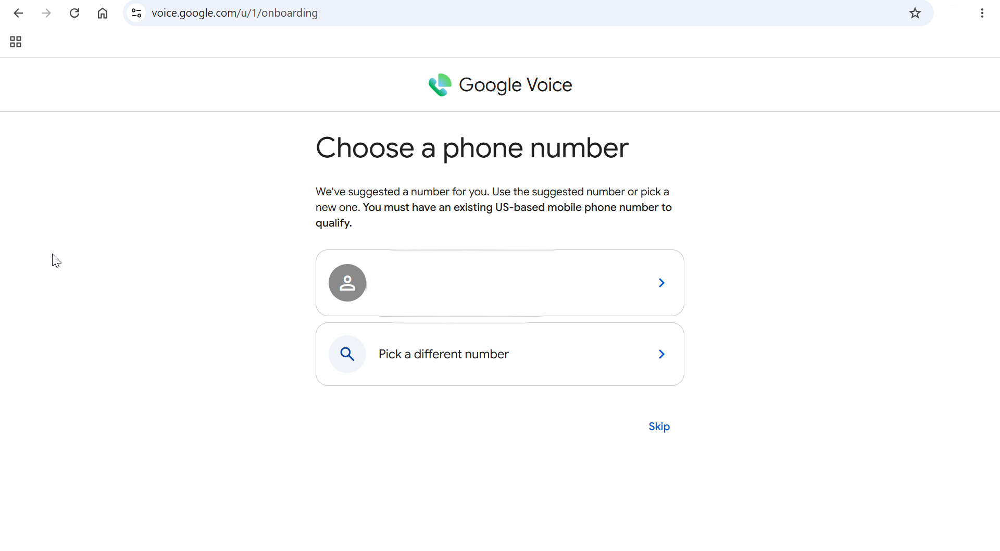

---

## Step 2 — Verify Your Identity

Google requires you to verify an existing phone number **and** a government-issued ID before a Google Voice number can send and receive texts.

1. On the "To finish setting up Google Voice" screen, review the tasks and click **Continue**.

   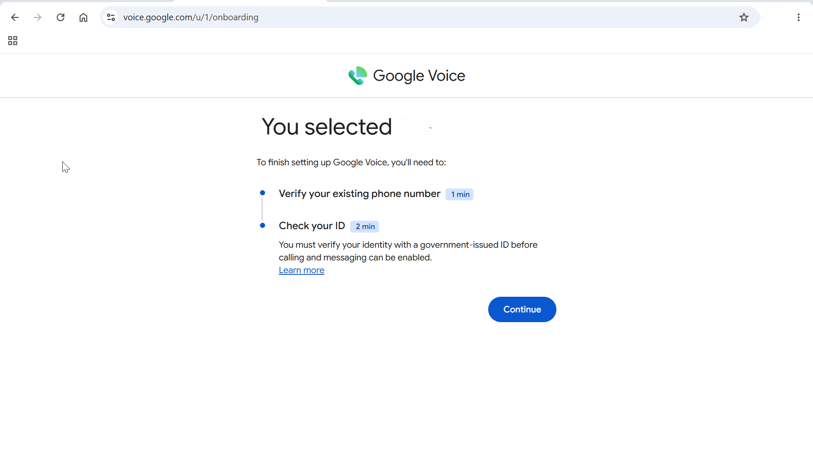

2. Enter an existing phone number to link, click **Send code**, and type in the 6-digit code Google texts you.

   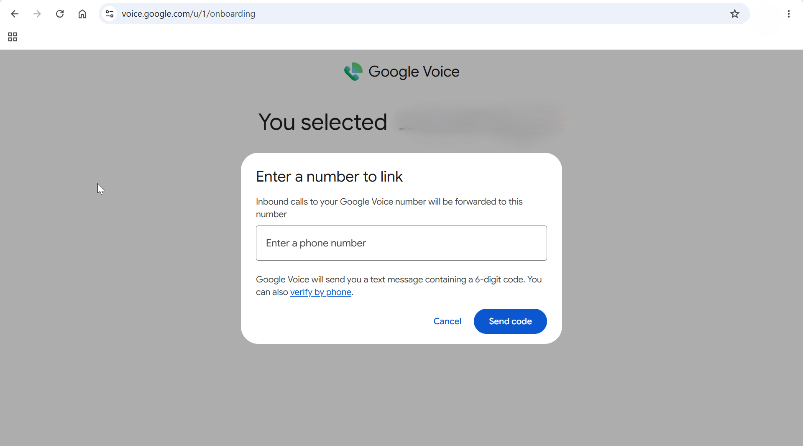

3. Start the identity check and click **Get started**.

   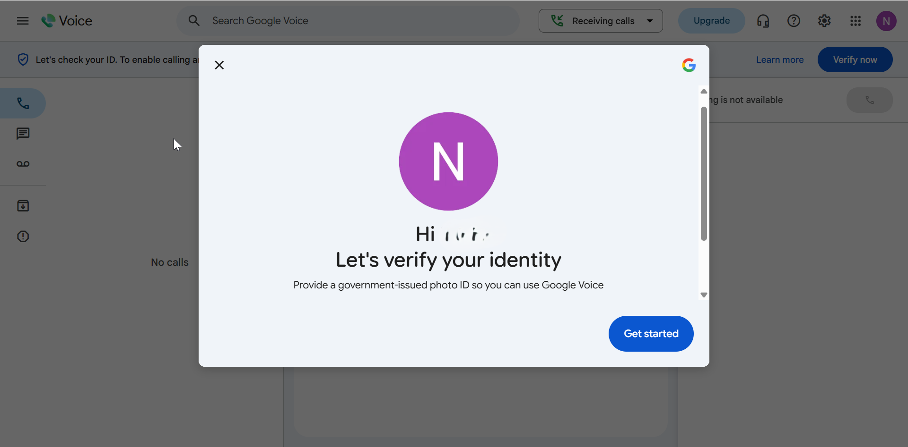

4. Choose an ID type (**Driver's License**, **Passport**, **State ID**, or **Green Card**), click **Next**, and follow the prompts to submit it.

   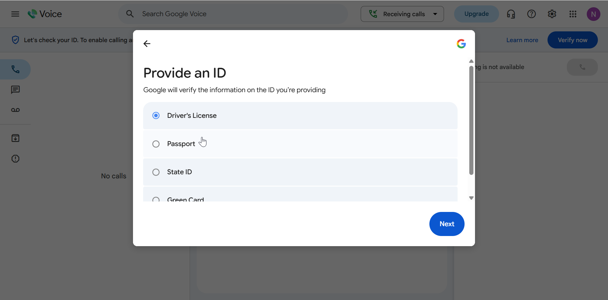

5. Once Google approves it, you'll see the verified confirmation.

   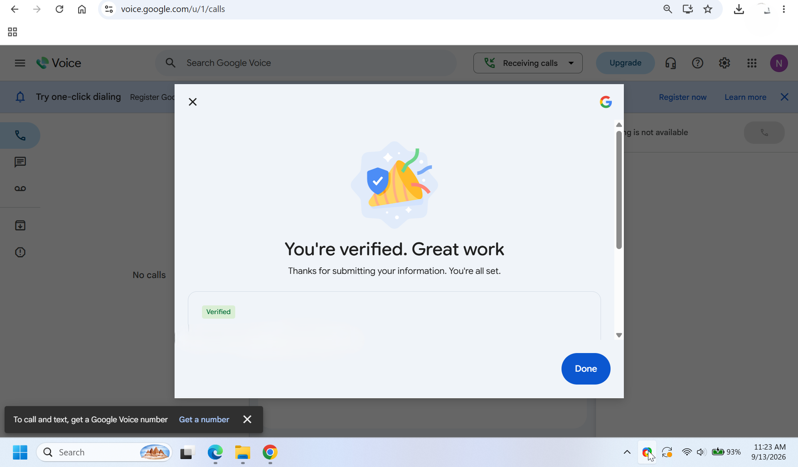

---

## Step 3 — Forward Messages to Email

**This is the key step that lets the plugin read your texts.**

1. In Google Voice, open **Settings** (gear icon) → **Messages**.
2. Turn **ON** **Forward messages to email**.
3. Confirm the email address shown is the Gmail account the plugin will use.

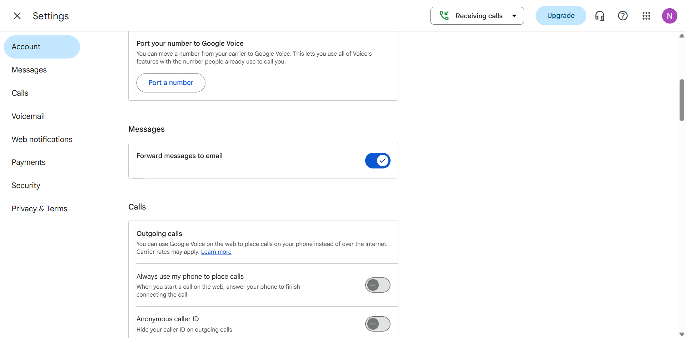

> ⚠️ Without this turned on, Google Voice keeps texts only inside its own app and the plugin has nothing to read — no names will ever reach your display.

---

## Step 4 — Turn Off Call Answering & Forwarding

Your Google Voice number is a **text line** for the show. You don't want it ringing your personal phone or a browser tab.

1. In Google Voice **Settings** → **Calls**.
2. Under **My devices**, turn **OFF** **Web** (and any other device).
3. Under **Call forwarding**, turn **OFF** your linked number.

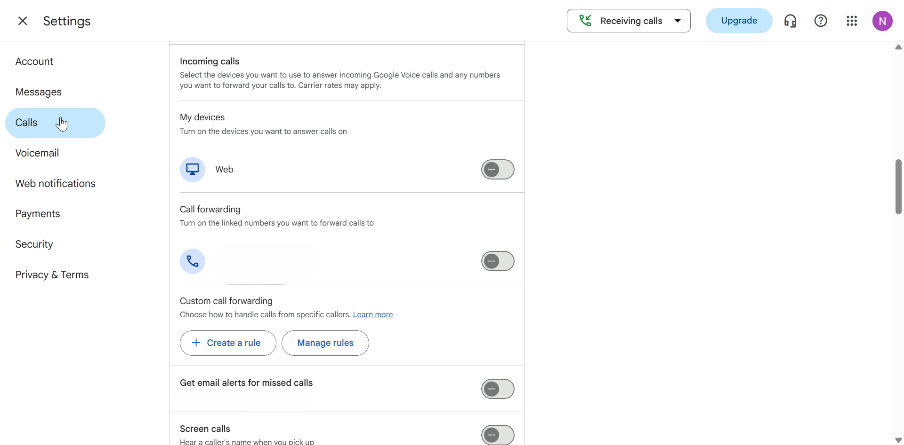

---

## Step 5 — Set Receiving Calls to Do Not Disturb

As a final safeguard so calls to the number never ring through, set your availability to **Do Not Disturb** — incoming calls go straight to voicemail.

1. At the top of Google Voice, click the **Receiving calls** dropdown.
2. Choose **Do not disturb** (toggle it **On**).

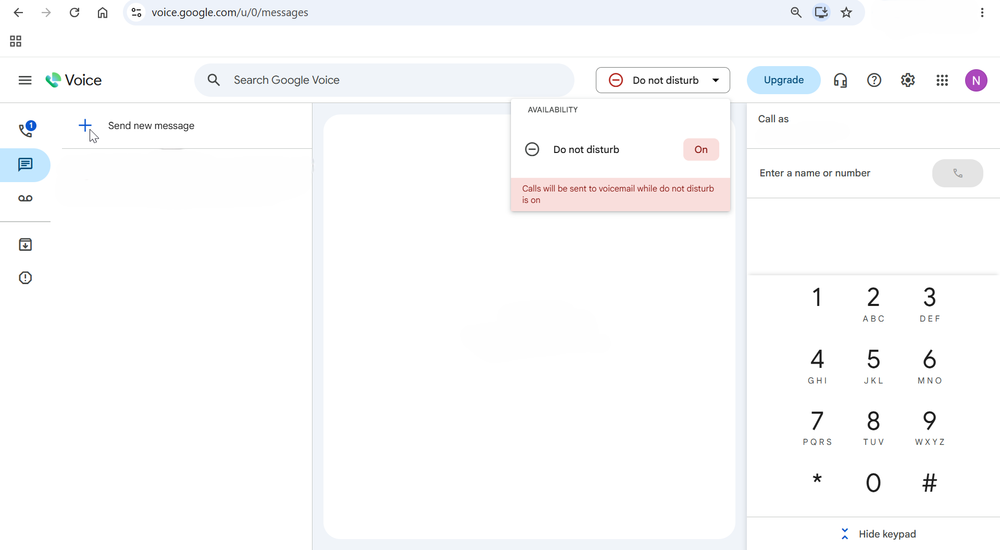

> With Do Not Disturb on, calls are sent to voicemail — texts (which the plugin reads via email) are unaffected.

---

## Step 6 — Turn Off Spam Filtering

1. In Google Voice **Settings** → **Security**.
2. Turn **OFF** **Filter spam calls and texts**.

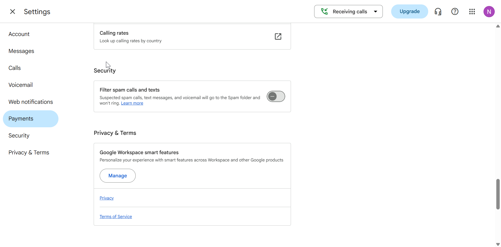

> **Why:** when lots of people text names at once, a burst of messages can look like spam to Google. With this on, those texts get quietly diverted to a Spam folder the plugin doesn't read — so names would silently go missing. Turning it off keeps every message flowing to the plugin.

---

## Step 7 — Enable 2-Step Verification

This one is in your **Google Account** settings, **not** Google Voice. It's required so you can create the **App Password** the plugin uses to log into Gmail.

1. Go to [myaccount.google.com](https://myaccount.google.com/) → **Security** (**Security & sign-in**).
2. Turn on **2-Step Verification** and complete the prompts.

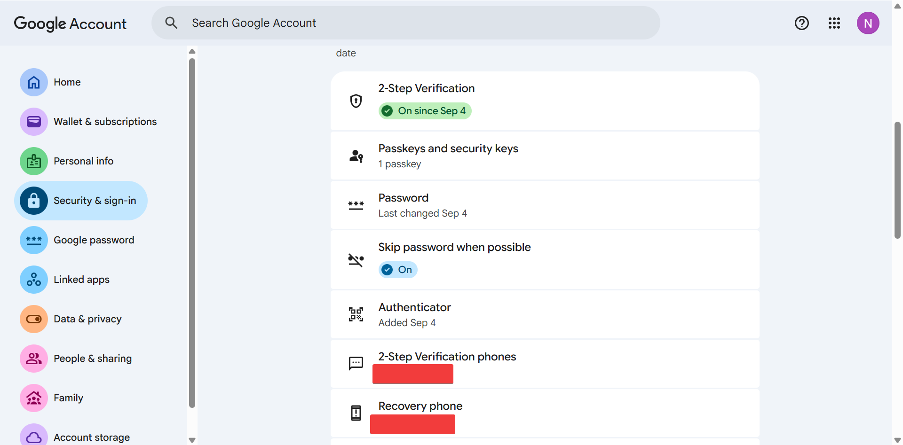

---

## Next Steps

With the Google Voice side configured, connect it to the plugin:

1. **Create a Gmail App Password:** Google Account → **Security** → **App passwords** → create one for **Mail**. Copy the 16-character password.
2. **In the plugin's Configuration tab:** set **SMS Provider** = **Google Voice**, enter your **Gmail address** and the **App Password**, then click **Test Google Voice Connection**.

Once the connection test passes, you're done — texts to your Google Voice number will appear on the display.

---

## Related Pages

- [Plugin Configuration](03-plugin-configuration.md) — enter your Google Voice credentials
- [Message Formatting](10-message-formatting.md) — how texts become names (identical for Twilio and Google Voice)
- [Troubleshooting](09-troubleshooting.md) — connection or delivery problems
